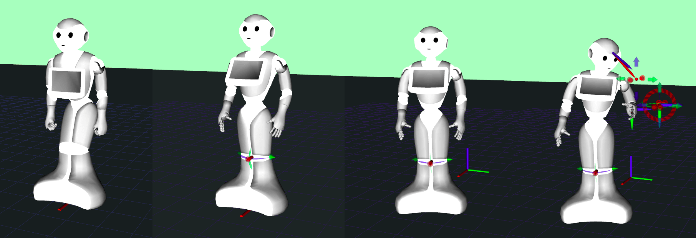

# PepperFSMController

---

## `topic/withHumanModel` branch

On this branch of a sample Pepper FSM `mc_rtc` controller we add two new objects to our controller

* Human model from [`mc_human`](https://gite.lirmm.fr/multi-contact/mc_human)
* Chair model from [`mc_rtc_data`](https://github.com/jrl-umi3218/mc_rtc_data)

This is an example of a multi-robot `mc_rtc` controller

You can see sample **`NavigateToHuman`** FSM state for basic multi-robot interaction example

---



This is a base [`mc_rtc`](https://github.com/jrl-umi3218/mc_rtc) FSM (finite-state machine) controller for Pepper humanoid robot.

The goal of this controller is to gather all **Pepper robot specific controller elements** that are very likely to be used by any `mc_rtc` FSM controller with Pepper as a `MainRobot`.

This way users writing `mc_rtc` controller for Pepper do not need to add these elements again every time, but can use this controller as a **starting point** and a **basic example**.

If you need to create a new `mc_rtc` controller that uses Peppper as a `MainRobot`, it is highly recommended to use this repository as a starting point for your project. You can either fork this repository or duplicate it by making a bare clone then pushing it to your repository:

```bash
git clone --bare https://gite.lirmm.fr/mc-controllers/pepperfsmcontroller PepperFSMController
cd PepperFSMController.git
git push --mirror https://gite.lirmm.fr/your_account/your_repository.git
cd ..
$ rm -rf PepperFSMController.git
```

## Required packages

* [`mc_rtc`](https://jrl-umi3218.github.io/mc_rtc/tutorials/introduction/installation-guide.html)
* [`mc_pepper`](https://gite.lirmm.fr/multi-contact/mc_pepper)
* [`mc_human`](https://gite.lirmm.fr/multi-contact/mc_human)


## List of Pepper specific controller elements:

* **BoundedAccelerationConstr** - acceleration bounds for mobile base
* **CoMRelativeBodyTask** - for defining CoM (center of mass) target wrt mobile base frame
* **dynamicsConstraint** - with modified torque limits for mobile base actuation
* **camOpticalFrame** - name of robot camera optical frame
* **uprightStanding** - posture target
* **mobileBaseTask** - high weight mobile base position task (must be always in solver)
* **comPlot** (bool true/false) - option to add CoM projection plot
* **Pepper device check** - check if `Speakers`, `Tablet` and `Bumper` devices are available on the `robot()`
* **Mobile base log entries** - added log entries about mobile base state (`base_q`, `base_alpha`, `base_alphaD`, `base_tau`)

#### List of FSM states

Besides the default `mc_rtc` FSM states (such as `HalfSitting`, `Pause_1s`, `Pause_5s` etc.) this base controller includes following basic states:

* **StandStraight** - upright Pepper posture
* **HandTaskStateLeft** - left end-effector task
* **HandTaskStateRight** - right end-effector task
* **HandTaskStateBoth** - state with end-effector tasks for both end-effectors
* **Wait** - pause for 10s
* **NavigateToHuman** - Pepper navigating to human model


## Building and installing the controller

```bash
cd PepperFSMController # navigate to controller root directory
mkdir build # create build directory
cd build # enter build directory
cmake .. # compile controller
make
sudo make install # install controller once successfully compiled
```

## Running the controller

Use your preferred interface to run this controller. Some option are:

* [`mc_rtc_ticker`](https://github.com/jrl-umi3218/mc_rtc_ros/tree/master/mc_rtc_ticker) from [`mc_rtc_ros`](https://github.com/jrl-umi3218/mc_rtc_ros)
* [`mc_naoqi`](https://gite.lirmm.fr/multi-contact/mc_naoqi)

Make sure to setup correctly following interface configuration entries:

```yaml
# What robot is being controlled
MainRobot: Pepper
# Enabled controllers
Enabled: PepperFSMController
```
## Visualizing the controller in [`RViz`](https://wiki.ros.org/rviz)

To visualize controller state in [`RViz`](https://wiki.ros.org/rviz), you will first need to ensure that you have [ROS](https://www.ros.org/) installed and [`mc_rtc`](https://github.com/jrl-umi3218/mc_rtc) built with [ROS](https://www.ros.org/) support.

Run `roslaunch launch/display.launch]`, using [`display.launch`](launch/display.launch) file provided in this repository, to launch controller display `RViz` node.

Once `RViz` node is started, configure it by clicking in `RViz` `File -> Open Config -> select file `[`mc_pepper_fsm_withHuman_display.rviz`](launch/mc_pepper_fsm_withHuman_display.rviz), provided in [`launch`](launch) folder in this repository

##### Add RViz configuration to ROS path

Optionally, you can configure `RViz` to use [`mc_pepper_fsm_withHuman_display.rviz`](launch/mc_pepper_fsm_withHuman_display.rviz) configuration automatically when running `roslaunch launch/display.launch` by adding it to your ROS path:

```cp launch/mc_pepper_fsm_withHuman_display.rviz ~/.ros/```
